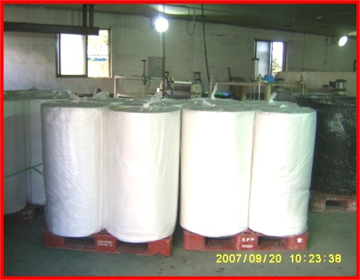
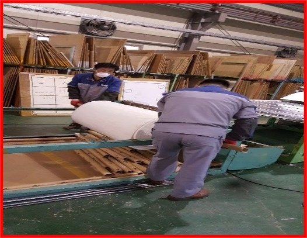
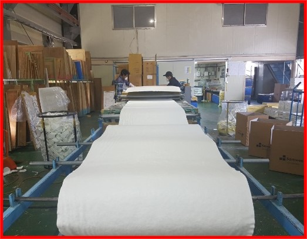
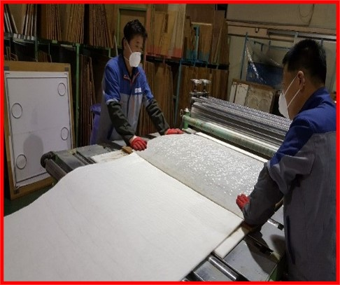
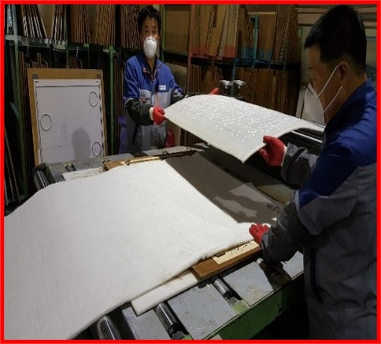
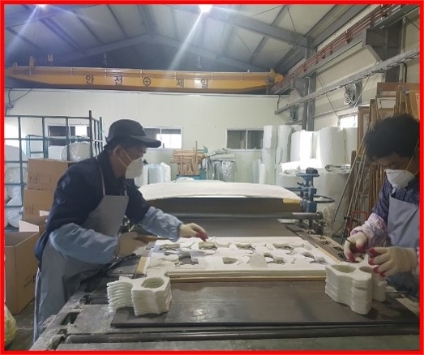
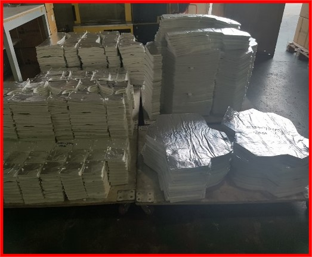
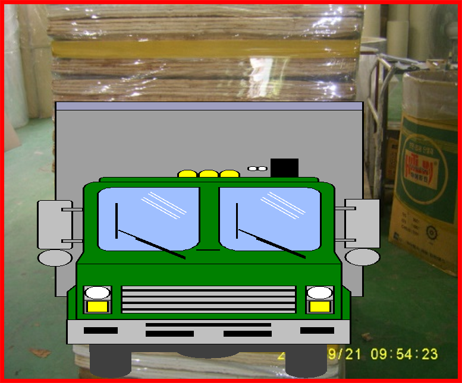

## 1. 원소재 입고

- 유리섬유와 기타 필요한 원자재를 공장에 반입하고 품질을 검사합니다.

## 2. 거취

- 유리섬유를 균일한 상태로 풀어 웹 형태로 만듭니다.

## 3. 적층

- 거취된 유리섬유 웹을 여러 층으로 쌓아 올려 원하는 두께를 만듭니다.

## 4. 함포

- 적층된 유리섬유에 접착제를 도포하고 압착하여 단일 시트로 만듭니다.

## 5. 컷팅

- 합포된 시트를 원하는 크기와 형태로 절단합니다.

## 6. 디자인 재단

- 고객 요구사항에 맞춰 단열제를 정밀하게 재단합니다.

## 7. 테이핑 검사 및 포장

- 재단된 단열제의 가장자리를 테이핑하고, 품질 검사 후 포장합니다.

## 8. 출고

- 완성된 유리섬유 단열제 제품을 창고에 보관하고 출하를 준비합니다.
