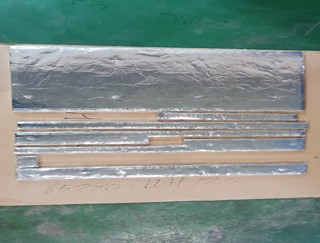
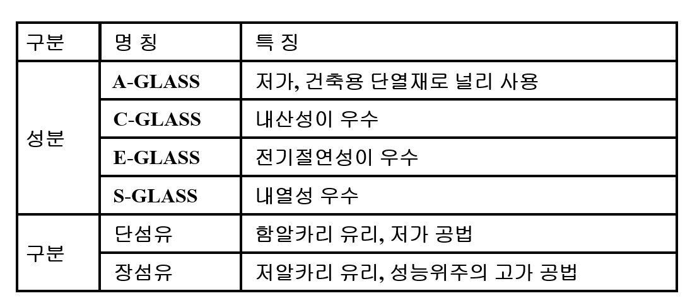

## 유리 섬유를 이용한 단열제 및 흡음제

유리 섬유는 뛰어난 물리적 특성과 화학적 안정성 덕분에 단열제와 흡음제로 널리 사용됩니다.

### 1. 유리 섬유 단열제
 
 

#### 특징
- **높은 열 저항성**: 유리 섬유는 열 전도율이 낮아 외부 온도의 영향을 효과적으로 차단합니다.
- **경량성**: 가벼운 특성 덕분에 설치와 운반이 용이합니다.
- **내화성**: 고온에서도 변형이나 연소가 적어 안전성이 높습니다.
- **우수한 음향 차단**: 유리 섬유의 다공성 구조는 음파를 흡수하여 소음을 줄이는 데 효과적입니다.
- **다양한 디자인**: 다양한 형태와 색상으로 제공되어 인테리어와 조화를 이룹니다.

유리 섬유를 이용한 단열제와 흡음제는 에너지 절약과 쾌적한 환경 조성에 중요한 역할을 합니다. 이 소재의 다양한 특성과 장점을 활용하면, 보다 효율적이고 안전한 공간을 만들 수 있습니다.
